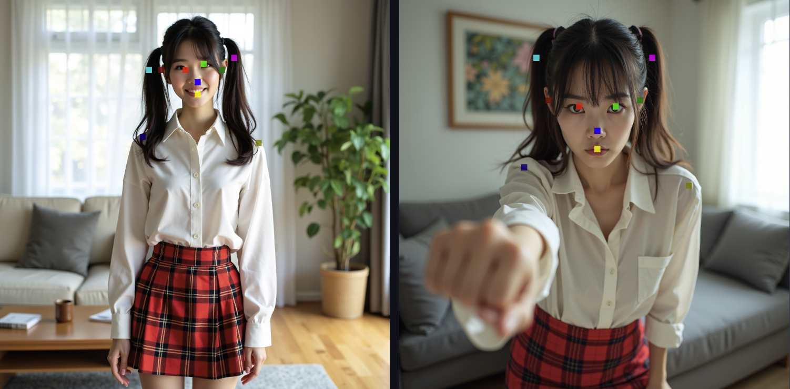

# An independent implementation of mask extraction and point matching

We have extracted the code related to the training-free **mask extraction** and **point matching** strategies and placed it in a separate folder here, for those who are interested in these details and need to use them. Additionally, we have provided a Gradio script, `visualize_gr.py`, for intuitive visualization.

## Script Usage Instructions

In addition to the external environment, Gradio needs to be installed separately:

``` bash
pip install gradio==3.36.1
```

Start the script using:

``` bash
python visualize_gr.py --model_path /path/to/FLUX.1-dev
```

and after the model initialization is complete, open the corresponding link. Then:

1. You can freely enter prompts for the background, foreground, and foreground actions in the `Prompt of the 1st` image and `Prompt of the 2nd image` sections at the bottom of the page. We have also provided an example.
2. Click the `Generate!` button and wait for the two images to be generated.
3. You can see the two generated images and their corresponding foreground masks in the four image boxes at the top of the page.
4. In `The 2nd image` box, click on a location within the image using the mouse. The point you clicked and the corresponding matched point in the other image will be visualized with the same color. You will see a result similar to the image below.

5. Each time you click, the `Similarity of clicked points pair` at the bottom of the page will display the similarity between the currently matched pair of points.
